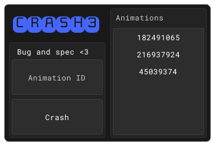

# CRASH3 (CV3)
## A troll script that was used to trick people into running a modified version of the c00lkidd decal spammer. It was made to look like a "universal crasher" gui.

### Files
- `CV3-DECRYPTED.lua` is the source file that has not been luafucked.
- `CV3LF.lua` is the luafucked version used to troll members of "client.tool." Luafucking can be reversed by replacing loadstring() with print().
- `Showcase.png` is an image simply used for this README.
- `UI_Place.rbxl` is the original studio file used to create this troll userinterface.
- `UserInterface.lua` is the file mentioned above converted into lua using Codify.

### Showcase

